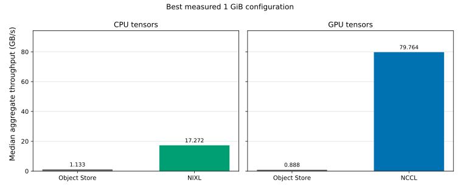

# Ray tensor transport on Perlmutter

This repository measures one-way tensor transfers between two Ray actors on
different Perlmutter GPU nodes. It compares Ray's TCP Object Store path with
Ray Direct Transport (RDT) over NCCL and NIXL.

This is a point-to-point transport benchmark. It is not an all-reduce, DDP,
training-throughput, or MPI benchmark.

## Terminology

| Term | Meaning |
|---|---|
| Flow | One independent sender-to-receiver tensor transfer. xN means N actor pairs transfer concurrently. |
| Batch | One transfer on every active flow; batch latency ends when all flows complete. |
| Rail | One physical CXI NIC/path. NIXL can stripe one flow across four rails; NCCL pins each flow to one rail. |
| Aggregate throughput | Total bytes transferred by every flow divided by batch duration. |

## Supported matrix

| Tensor path | Ray Object Store | NCCL RDT | NIXL RDT |
|---|---|---|---|
| CPU to CPU | HSN/TCP | Not applicable<sup>1</sup> | LIBFABRIC/CXI |
| GPU to GPU | HSN/TCP with host staging | LIBFABRIC/CXI with PHB GDRDMA | Currently unavailable<sup>2</sup> |

<sup>1</sup> NCCL RDT has no CPU-tensor path.<br>
<sup>2</sup> NIXL 1.3.2's LIBFABRIC topology does not expose CXI as GPU-capable;
the benchmark does not substitute a fallback transport.

Ray's control plane uses TCP in every mode. The network labels in the table
refer to the tensor payload: Object Store payloads use `hsn0`, while NCCL and
NIXL payloads use native CXI.

## Results

### Best single-NIC configurations

Each flow transferred a 1 GiB tensor. These are the best measured aggregate
rates within the in-scope single-interface sweeps:

| Tensor | Transport | Best flow count | Median aggregate GB/s |
|---|---|---:|---:|
| CPU | Ray Object Store over HSN/TCP | 8 | 1.133 |
| CPU | NIXL over LIBFABRIC/CXI | 4 | 8.939 |
| GPU | Ray Object Store with host staging | 8 | 0.888 |
| GPU | NCCL over aws-ofi-nccl/CXI | 1 | 21.700 |

### Best multi-NIC configurations

| Tensor | Transport | Configuration | Total flows | Median aggregate GB/s |
|---|---|---|---:|---:|
| CPU | NIXL, four striped CXI rails | Each flow striped over 4 NICs | 8 | 17.272 |
| GPU | NCCL, four CXI NICs | 1 flow per NIC | 4 | 79.764 |



The chart compares each transport's fastest tested configuration; the tables
above give the differing flow and NIC counts. Both panels use the same y-axis
scale.

The main outcomes were:

- NCCL performed best with one flow per NIC. Additional flows on a single NIC
  reduced aggregate throughput.
- NCCL reached 79.8 GB/s across four NICs, 3.65x its one-NIC result.
- NIXL CPU transport reached 8.94 GB/s on one interface and 17.27 GB/s with
  four-rail striping.
- Object Store throughput increased with concurrency but was close to its
  observed maximum by eight flows.

At the common single-flow 1 GiB measurement, median (p95) batch latency
was 224 ms (225 ms) for NIXL versus 1.99 s (2.01 s) for Object Store on CPU,
and 49.5 ms (49.8 ms) for NCCL versus 2.32 s (2.36 s) for host-staged Object
Store on GPU.

Object Store stages GPU payloads through host memory, while NCCL uses GDRDMA,
so their GPU rates do not represent equivalent transfer paths. See the
[full results, tables, and figures](results.md) or download the
[machine-readable CSV](results/benchmark-results.csv).

## Benchmark design

The complete published matrix contains 32 measured scenarios:

- **Baseline:** one flow at 1 MiB, 64 MiB, and 1 GiB for all four supported
  transport/device series (12 results).
- **Single-interface saturation:** Object Store and NCCL use 1, 2, 4, and 8
  concurrent 1 GiB flows; NIXL uses 1, 2, and 4 (15 results total).
- **CXI scaling:** NIXL uses 4 and 8 total flows, each striped over all four
  NICs. NCCL uses one independently pinned flow on each of 1, 2, and 4 NICs
  (5 results total).

Higher NIXL concurrency was excluded because x8 single-rail and x16 total
four-rail runs exhausted CXI memory-registration resources
(`fi_mr_enable: ENOSPC`); this was not host-memory OOM.

For each single-NIC sweep, the reported operating point is the smallest tested
flow count whose median throughput is within 95% of that sweep's best result.

Every scenario uses three warmups and ten measured batches. Actor creation,
payload allocation, and transport initialization happen before the timer.
Throughput is total bytes completed by all flows divided by batch duration, and
every received tensor is fully verified outside the timer. See the
[transport configuration](docs/transport-configuration.md) for topology,
affinity, lifecycle, and stack details.

See [previous testing](docs/previous-testing.md) for the PHB/GDRDMA comparison
and the failures that motivated the current configuration and concurrency
limits.

## Build

The image adds CuPy and NIXL 1.3.2 to NERSC's PyTorch image:

```bash
podman-hpc build -t ray-bench-pytorch:26.01.01-nixl1.3.2 .
```

## Run

Allocate exactly two GPU nodes with all four GPUs visible to the one Slurm task
on each node. For example:

```bash
salloc -N 2 -C gpu -q interactive -t 01:30:00 \
  --ntasks-per-node=1 --cpus-per-task=128 --gpus-per-node=4
```

```bash
./run_benchmarks.sh --transport object \
  --image ray-bench-pytorch:26.01.01-nixl1.3.2
./run_benchmarks.sh --transport nixl --nixl-rails 1 \
  --image ray-bench-pytorch:26.01.01-nixl1.3.2
./run_benchmarks.sh --transport nixl --nixl-rails 4 \
  --image ray-bench-pytorch:26.01.01-nixl1.3.2
./run_benchmarks.sh --transport nccl --nccl-suite sweep \
  --image ray-bench-pytorch:26.01.01-nixl1.3.2
```

Run each transport in a fresh allocation. Keep NIXL's single-rail and four-rail
runs separate, and keep NCCL's sweep and scaling runs separate. For NCCL
scaling, pass the sweep's reported `flows_per_nic` operating point:

```bash
./run_benchmarks.sh --transport nccl --nccl-suite scaling \
  --nccl-flows-per-nic <OPERATING_POINT> \
  --image ray-bench-pytorch:26.01.01-nixl1.3.2
```

Benchmark runs create raw logs only; publishing is a separate, explicit step.
Use `--smoke` for a quick transport check.

See [transport configuration](docs/transport-configuration.md) for device
exposure, topology and affinity, environment settings, session-isolation
requirements, and known pitfalls.

## Publish results

The publisher consumes five locally retained transport logs and requires
matching images and Ray, PyTorch, and CUDA versions. Its command-line interface
is documented by `./publish_results.sh --help`.

A successful publication updates the
[canonical 32-row CSV](results/benchmark-results.csv) and the SVG figures
embedded in this README and the [detailed results](results.md).

The publisher validates each result and its supporting path, affinity, stack,
and lifecycle evidence before atomically replacing the artifacts. The public
CSV contains no local log paths or run identifiers; raw logs and their
provenance index remain local and are ignored by Git.

## Local checks

The dependency-free checks can run on a login node with Python 3.11:

```bash
python3.11 -m unittest -v test_benchmark_tools.py
python3.11 -m py_compile \
  benchmark_stats.py benchmark_common.py ray_transfer_bench.py \
  ray_nccl_bench.py ray_nixl_bench.py ray_nixl_multirail_bench.py \
  plot_benchmark_results.py
bash -n run_benchmarks.sh publish_results.sh
```

## References

- [Ray Direct Transport](https://docs.ray.io/en/latest/ray-core/direct-transport.html)
- [Ray on Slurm](https://docs.ray.io/en/latest/cluster/vms/user-guides/community/slurm.html)
- [NERSC Perlmutter architecture](https://docs.nersc.gov/systems/perlmutter/architecture/)
- [NERSC GPU affinity](https://docs.nersc.gov/jobs/affinity/)
- [AWS OFI NCCL](https://github.com/aws/aws-ofi-nccl)
- [libfabric CXI provider](https://ofiwg.github.io/libfabric/main/man/fi_cxi.7.html)
- [NIXL](https://github.com/ai-dynamo/nixl)
