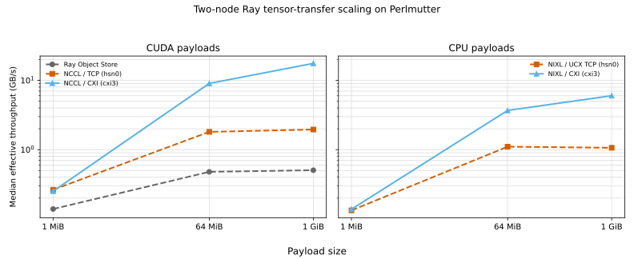

# Ray transfer benchmarks on Perlmutter

This repository compares one-way PyTorch tensor transfers between Ray actors
on two NERSC Perlmutter nodes using either the Ray Object Store or Ray Direct
Transport (RDT). The RDT modes use NCCL or NIXL over TCP or native CXI. Every
run verifies the complete payload; RDT runs also validate their
backend/provider from runtime logs, while the Object Store's low-level provider
is not asserted. This is a point-to-point, single-tensor microbenchmark, not a
measurement of DDP, all-reduce, multi-GPU scaling, or training throughput.

## Benchmark modes

| Mode | Payload | Measured transfer path |
|---|---|---|
| `object` | CUDA → CUDA | Ray Object Store (`ObjectRef`); the low-level network provider is not asserted |
| `rdt-tcp` (NCCL) | CUDA → CUDA | Ray Direct Transport (RDT) → NCCL → AWS OFI NCCL → libfabric `tcp` on `hsn0` |
| `rdt-cxi` (NCCL) | CUDA → CUDA | Ray RDT → NCCL → AWS OFI NCCL → libfabric `cxi3` → Slingshot 11 |
| `rdt-nixl-cxi-cpu` | CPU → CPU | Ray RDT → NIXL `LIBFABRIC` → libfabric `cxi3` → Slingshot 11 |
| `rdt-nixl-ucx-tcp-cpu` | CPU → CPU | Ray RDT → NIXL `UCX` → UCX TCP on `hsn0` |

> [!NOTE]
> The CXI modes use native libfabric/CXI. The NIXL/UCX mode uses kernel TCP
> over `hsn0`, not native CXI/RDMA.

> [!NOTE]
> Four-device testing did not benefit this single-stream benchmark. NCCL
> discovered all four devices but continued to transfer only through `cxi3`;
> NIXL striped across all four but was slower than one rail. The standard
> matrix therefore uses `cxi3` only. See
> [Perlmutter transport findings](docs/perlmutter-transport-findings.md#network-device-count-must-be-controlled-explicitly).

> [!WARNING]
> NIXL GPU modes are unavailable in this stack. NIXL's bundled UCX lacks CUDA
> memory support, while NIXL 1.3.2 LIBFABRIC misclassifies CXI as having no
> GPUs. See [Perlmutter transport findings](docs/perlmutter-transport-findings.md).

## Performance

The standard comparison uses three `torch.uint8` payload sizes. A 1 MiB run
captures small-transfer Ray/transport overhead, not raw NIC latency; 64 MiB
shows the transition toward bandwidth saturation, and 1 GiB measures bulk
throughput. Every published value must pass full-payload and transport-evidence
validation.

| Mode | Network selection | 1 MiB median ms | 64 MiB median GB/s | 1 GiB median GB/s |
|---|---|---:|---:|---:|
| `object` | Provider not asserted | 7.539 | 0.479 | 0.505 |
| `rdt-tcp` (NCCL) | `hsn0` | 3.975 | 1.808 | 1.952 |
| `rdt-cxi` (NCCL) | `cxi3` | 4.168 | 9.037 | 17.596 |
| `rdt-nixl-cxi-cpu` | `cxi3` | 7.586 | 3.684 | 6.009 |
| `rdt-nixl-ucx-tcp-cpu` | `hsn0` | 7.886 | 1.104 | 1.064 |

For bulk transfers, native CXI was the clear winner within each payload
family: NCCL/CXI reached 17.596 GB/s for CUDA, while NIXL/LIBFABRIC CXI reached
6.009 GB/s for CPU. The CUDA/NCCL and CPU/NIXL results are separate comparisons
and should not be treated as a direct backend head-to-head.



The machine-readable values and source-log names are in
[`results/benchmark-results.csv`](results/benchmark-results.csv).

These 15 validated standard-matrix results were collected across two separate
two-node Slurm allocations, so normal allocation-to-allocation or node-pair
variability may be present. NCCL/CXI used `NCCL_NET_GDR_LEVEL=LOC` (host
staging). `plot_benchmark_results.py` validates the complete matrix and
generates a two-panel, log-scaled throughput figure at
`docs/benchmark-throughput.svg`. The tool refuses to publish a partial matrix.

## Build and run

Build the image and select it for subsequent runs:

```bash
podman-hpc build -t ray-bench-pytorch:26.01.01-nixl1.3.2 -f Containerfile .
export IMAGE=ray-bench-pytorch:26.01.01-nixl1.3.2
```

The launcher requires `IMAGE` to be exported and records its value in every
benchmark log; it does not fall back to the unmodified base image.

Allocate two GPU nodes to run the complete matrix:

```bash
export NERSC_ACCOUNT=<your_gpu_account>

salloc \
  --nodes=2 \
  --qos=interactive \
  --time=01:00:00 \
  --constraint="gpu&hbm40g" \
  --account="${NERSC_ACCOUNT}" \
  --ntasks-per-node=1 \
  --gpus-per-node=4 \
  --cpus-per-task=128
```

Run any mode from the table:

```bash
BENCH=<mode> \
BENCH_ARGS="--size-mb 1024 --warmup 2 --iterations 7" \
  ./run_ray_symmetric_bench_interactive.sh
```

For a quick smoke test first, use
`BENCH_ARGS="--size-mb 64 --warmup 1 --iterations 2"`.

`rdt-tcp` is always pinned to `hsn0`. Native-CXI runs default to
`CXI_RAILS=1`, which selects `cxi3`. `CXI_RAILS=4` remains available for
exploratory diagnostics but is not part of the standard matrix.
With only `cxi3` exposed, NCCL labels it provider device `/0/`; that local
index does not mean the transfer used physical device `cxi0`.

The `cxi3` default is consistent with Perlmutter's GPU/NIC PCIe affinity.
NERSC's documented reverse-binding example assigns physical GPU 3 to local
rank 0; `CUDA_VISIBLE_DEVICES` then presents it as logical `cuda:0`. NCCL
selected physical `cxi3` for Ray's chosen GPU when all four NICs were visible,
although the benchmark did not record enough GPU topology data to prove that
Ray's logical `cuda:0` was physical GPU 3. See
[Perlmutter transport findings](docs/perlmutter-transport-findings.md#network-device-count-must-be-controlled-explicitly).

Run the official three-size matrix with size-dependent warmups and measured
iterations:

```bash
export NCCL_NET_GDR_LEVEL=LOC

run_case() {
  local mode="$1"
  local rails="$2"
  local size_mib="$3"
  local warmup="$4"
  local iterations="$5"

  if [[ -n "${rails}" ]]; then
    CXI_RAILS="${rails}" \
    BENCH="${mode}" \
    BENCH_ARGS="--size-mb ${size_mib} --warmup ${warmup} --iterations ${iterations}" \
      ./run_ray_symmetric_bench_interactive.sh
  else
    BENCH="${mode}" \
    BENCH_ARGS="--size-mb ${size_mib} --warmup ${warmup} --iterations ${iterations}" \
      ./run_ray_symmetric_bench_interactive.sh
  fi
}

configs=(
  "object:"
  "rdt-tcp:"
  "rdt-cxi:1"
  "rdt-nixl-cxi-cpu:1"
  "rdt-nixl-ucx-tcp-cpu:"
)
profiles=("1:5:31" "64:3:15" "1024:2:7")

for profile in "${profiles[@]}"; do
  IFS=: read -r size_mib warmup iterations <<< "${profile}"
  for config in "${configs[@]}"; do
    IFS=: read -r mode rails <<< "${config}"
    run_case "${mode}" "${rails}" "${size_mib}" "${warmup}" "${iterations}"
  done
done
```

After all runs finish, generate the canonical CSV and SVG inside the benchmark
image, which already contains Matplotlib:

```bash
shopt -s nullglob
logs=("${SCRATCH}"/ray-*-{1,64,1024}MiB-"${SLURM_JOB_ID}".log)
(( ${#logs[@]} == 15 )) || {
  echo "ERROR: expected 15 standard-matrix logs, found ${#logs[@]}" >&2
  false
}

podman-hpc run --rm --network=none \
  -v "${PWD}:/workdir" \
  -v "${SCRATCH}:${SCRATCH}:ro" \
  -w /workdir \
  "${IMAGE}" \
  python -u /workdir/plot_benchmark_results.py \
    --csv /workdir/results/benchmark-results.csv \
    --svg /workdir/docs/benchmark-throughput.svg \
    "${logs[@]}"
```

## Reading a result

A successful run ends with three independently useful records:

```text
RESULT benchmark=rdt-nixl-ucx-tcp-cpu bytes=1073741824 warmup=2 iterations=7 median_ms=1008.753131 median_GBps=1.064425 median_Gbitps=8.515398 transfer_status=pass
EVIDENCE backend=UCX local=self/memory transport=tcp device=hsn0 status=pass
SHUTDOWN_STATUS=clean
```

- `RESULT` means the transfer completed, every received byte was verified, and
  reports median end-to-end latency and effective payload throughput.
- `EVIDENCE` means the expected backend/provider appeared in the actual
  transfer log and conflicting fallbacks were absent.
- `SHUTDOWN_STATUS` distinguishes a valid result from an abnormal Ray exit.

Logs are written to `$SCRATCH/ray-<mode>-<size>MiB-<job-id>.log`. CXI log
names additionally include `-1cxi`; exploratory four-device runs use `-4cxi`,
so they cannot overwrite standard results. `RAY_BENCH_LOG` and
`RAY_BENCH_TIMEOUT_SECONDS` override the path and timeout.

## Repository layout

- `run_ray_symmetric_bench_interactive.sh`: Slurm, Podman-HPC, preflight, and
  transport-evidence orchestration.
- `ray_*_bench.py` and `benchmark_common.py`: transfer drivers and shared
  placement, verification, and result logic.
- `plot_benchmark_results.py` and `results/benchmark-results.csv`: strict log
  validation, canonical results, and the Matplotlib throughput figure.
- `Containerfile`: reproducible benchmark image.

See [Perlmutter transport findings](docs/perlmutter-transport-findings.md) for
the Ray/NIXL backend patch, container networking issues, UCX isolation fix,
and known limitations.

## References

- Ray: [Object Store](https://docs.ray.io/en/latest/ray-core/objects.html) and
  [Direct Transport](https://docs.ray.io/en/latest/ray-core/direct-transport.html)
- [NVIDIA Inference Xfer Library (NIXL)](https://github.com/ai-dynamo/nixl)
- [AWS OFI NCCL plugin](https://github.com/aws/aws-ofi-nccl)
- [OpenUCX transport and device selection](https://github.com/openucx/ucx/blob/master/docs/source/faq.md#network-capabilities)
- NCCL 2.29.2: [environment variables](https://docs.nvidia.com/deeplearning/nccl/archives/nccl_2292/user-guide/docs/env.html)
  and [release notes](https://docs.nvidia.com/deeplearning/nccl/archives/nccl_2307/release-notes/rel_2-29-2.html)
- NERSC: [Perlmutter architecture](https://docs.nersc.gov/systems/perlmutter/architecture/),
  [GPU affinity](https://docs.nersc.gov/jobs/affinity/),
  [CUDA-aware MPI affinity example](https://www.nersc.gov/assets/Uploads/NUGcall_GPUaware_Perlmutter.pdf),
  and [Podman-HPC](https://docs.nersc.gov/development/containers/podman-hpc/overview/)
- libfabric 1.22 providers: [CXI](https://ofiwg.github.io/libfabric/v1.22.0/man/fi_cxi.7.html)
  and [TCP](https://ofiwg.github.io/libfabric/v1.22.0/man/fi_tcp.7.html)
