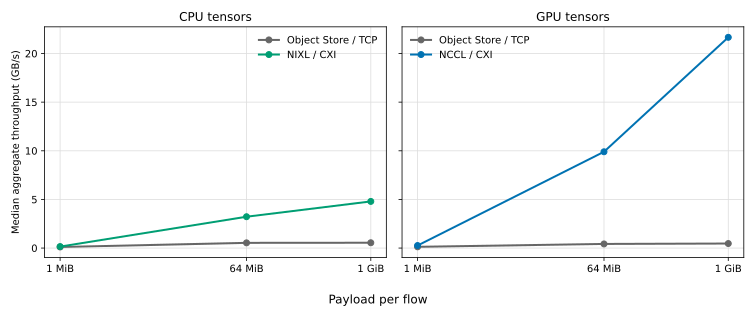
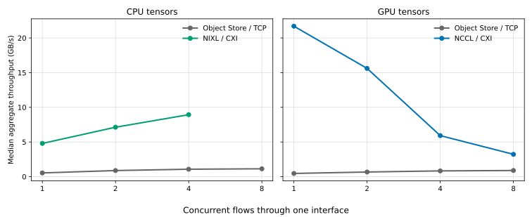
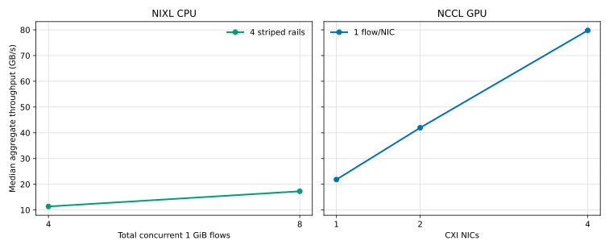

# Benchmark results

This report summarizes the 32 in-scope measurements from the two-node
Perlmutter tensor-transport study. The complete machine-readable dataset is
available in [results/benchmark-results.csv](results/benchmark-results.csv).

## Headline results

Each flow transferred a 1 GiB tensor. The table reports the best measured
aggregate throughput within each in-scope single-interface sweep.

| Tensor | Transport | Best flow count | Median aggregate GB/s |
|---|---|---:|---:|
| CPU | Ray Object Store over HSN/TCP | 8 | 1.133 |
| CPU | NIXL over LIBFABRIC/CXI | 4 | 8.939 |
| GPU | Ray Object Store with host staging | 8 | 0.888 |
| GPU | NCCL over aws-ofi-nccl/CXI | 1 | 21.700 |

The best measured multi-rail configurations were:

| Tensor | Transport | Configuration | Total flows | Median aggregate GB/s |
|---|---|---|---:|---:|
| CPU | NIXL, four striped CXI rails | 2 flows per NIC | 8 | 17.272 |
| GPU | NCCL, four CXI NICs | 1 flow per NIC | 4 | 79.764 |

NCCL performed best with one flow per NIC: adding concurrent flows to a single
NIC reduced throughput. Holding that operating point constant and scaling from
one to four NICs increased aggregate throughput by 3.65x. NIXL reached 8.94
GB/s on one CXI interface and 17.27 GB/s with four-rail striping. Object Store
throughput improved with concurrency but was already close to its observed
maximum by eight flows.

The Object Store GPU path stages tensors through host memory. It is therefore
not equivalent to, and should not be compared directly as, a GPU-direct
alternative to NCCL GDRDMA.

## Test design

The benchmark measured one-way transfers between two Ray actors on different
Perlmutter GPU nodes. Every scenario used three warmups followed by ten measured
batches. Actor creation, payload allocation, transport initialization, and
payload verification were outside the timer.

Rates are decimal GB/s. Concurrent cases report aggregate throughput: the
total bytes completed by all flows divided by the batch duration. The selected
operating point is the smallest tested flow count whose median throughput was
within 95% of the best result in that sweep.

The published matrix contains:

- 12 single-flow baselines: 1 MiB, 64 MiB, and 1 GiB for four supported
  transport/tensor combinations.
- 15 single-interface 1 GiB concurrency results: x1/x2/x4/x8 for Object Store
  and NCCL, and x1/x2/x4 for NIXL.
- Two NIXL four-rail results at one and two flows per NIC.
- Three NCCL scaling results using one flow per NIC across one, two, and four
  NICs.

## Payload scaling

| Tensor | Transport | 1 MiB GB/s | 64 MiB GB/s | 1 GiB GB/s |
|---|---|---:|---:|---:|
| CPU | Object Store | 0.109 | 0.534 | 0.544 |
| CPU | NIXL | 0.150 | 3.220 | 4.794 |
| GPU | Object Store, host staged | 0.125 | 0.422 | 0.464 |
| GPU | NCCL, GDRDMA | 0.260 | 9.898 | 21.666 |

The transport distinction becomes pronounced as payloads grow. At 1 GiB,
single-flow NIXL delivered 8.8x the Object Store CPU rate, while NCCL delivered
46.7x the host-staged Object Store GPU rate. The GPU comparison describes the
two implemented paths, not equivalent memory-transfer semantics.

## Single-interface flow scaling

All rows below transfer 1 GiB per flow through one network interface.

| Tensor | Transport | Flows | Median ms | p95 ms | Median aggregate GB/s |
|---|---|---:|---:|---:|---:|
| CPU | Object Store | 1 | 1987.371 | 2011.293 | 0.540 |
| CPU | Object Store | 2 | 2438.818 | 2876.780 | 0.881 |
| CPU | Object Store | 4 | 4002.305 | 4126.130 | 1.073 |
| CPU | Object Store | 8 | 7582.638 | 7666.970 | 1.133 |
| CPU | NIXL | 1 | 223.962 | 225.211 | 4.794 |
| CPU | NIXL | 2 | 301.129 | 304.337 | 7.131 |
| CPU | NIXL | 4 | 480.476 | 482.922 | 8.939 |
| GPU | Object Store, host staged | 1 | 2321.202 | 2360.274 | 0.463 |
| GPU | Object Store, host staged | 2 | 3206.725 | 3251.170 | 0.670 |
| GPU | Object Store, host staged | 4 | 5174.096 | 5519.364 | 0.830 |
| GPU | Object Store, host staged | 8 | 9672.890 | 9859.733 | 0.888 |
| GPU | NCCL, GDRDMA | 1 | 49.481 | 49.816 | 21.700 |
| GPU | NCCL, GDRDMA | 2 | 137.532 | 239.039 | 15.614 |
| GPU | NCCL, GDRDMA | 4 | 725.829 | 1747.110 | 5.917 |
| GPU | NCCL, GDRDMA | 8 | 2667.307 | 3681.523 | 3.220 |

Object Store gained 2.10x on CPU and 1.92x on GPU from x1 to x8. Its x4-to-x8
gain was only 5.6% on CPU and 7.0% on GPU. Single-interface NIXL gained 86.4%
from x1 to x4 and delivered 7.89x the best Object Store CPU rate.

NCCL behaved differently: relative to x1, aggregate throughput fell by 28.1%
at x2, 72.7% at x4, and 85.2% at x8. Its selected operating point was therefore
one flow per NIC.

## Multi-rail scaling

| Tensor | Transport | NICs | Flows per NIC | Total flows | Median ms | p95 ms | Median aggregate GB/s |
|---|---|---:|---:|---:|---:|---:|---:|
| CPU | NIXL, striped | 4 | 1 | 4 | 377.458 | 397.485 | 11.379 |
| CPU | NIXL, striped | 4 | 2 | 8 | 497.341 | 503.379 | 17.272 |
| GPU | NCCL, GDRDMA | 1 | 1 | 1 | 49.183 | 49.609 | 21.831 |
| GPU | NCCL, GDRDMA | 2 | 1 | 2 | 51.183 | 52.517 | 41.957 |
| GPU | NCCL, GDRDMA | 4 | 1 | 4 | 53.846 | 56.481 | 79.764 |

Each NIXL logical flow was natively striped across all four CXI rails. Moving
from one to two flows per NIC increased aggregate throughput by 51.8%. NCCL
used independent NUMA-local GPU flows, one per NIC; two NICs delivered 1.92x
and four NICs delivered 3.65x the one-NIC aggregate rate.

## NIXL concurrency limit

Higher NIXL concurrency was tested but is not part of the reported matrix.
Eight simultaneous flows on one rail and four flows per NIC across four rails
(16 total) failed during CXI memory registration, including optimized-MR
PTE-link failures and fi_mr_enable returning ENOSPC. The published results stop
at the validated lower-concurrency cases.

## Validation and reproducibility

Every included row passed full payload validation and the benchmark's transport,
topology, NUMA-affinity, and evidence checks. The CSV retains those status
fields along with the tested software versions, sampling counts, transport
configuration, latency, throughput, and hardware placement. Local raw logs and
their provenance index are intentionally excluded from version control.
